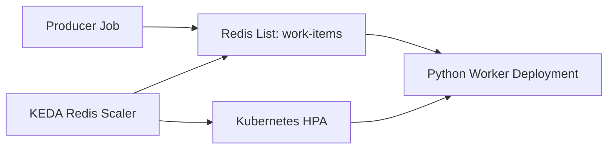

# KEDA Event-Driven Autoscaling Demo

Reference demo for queue-driven Kubernetes autoscaling with KEDA.

This sample shows a small Redis-backed worker system that scales based on queue depth. It is intentionally lightweight so the important platform pattern is easy to inspect: workloads should scale with actual event pressure, not only CPU or static replica counts.

## Architecture



## What This Demonstrates

- A queue-backed worker workload that can scale to zero when idle.
- A KEDA `ScaledObject` that watches Redis list length.
- Scale-out when backlog grows and scale-in after the queue drains.
- Practical guardrails such as min/max replicas and cooldown behavior.

## Repository Layout

```text
.
├── Makefile
├── app
│   ├── Dockerfile
│   ├── producer.py
│   ├── requirements.txt
│   └── worker.py
└── k8s
    ├── kustomization.yaml
    ├── namespace.yaml
    ├── producer-job.yaml
    ├── redis.yaml
    ├── scaledobject.yaml
    └── worker.yaml
```

## Prerequisites

- Kubernetes cluster, for example `kind`, `minikube`, GKE, EKS, or AKS.
- `kubectl`
- KEDA installed in the cluster.
- Docker or a compatible image builder.

Install KEDA with Helm:

```bash
helm repo add kedacore https://kedacore.github.io/charts
helm repo update
helm install keda kedacore/keda --namespace keda --create-namespace
```

## Run Locally With Kind

Create a cluster if needed:

```bash
kind create cluster --name keda-demo
```

Build and load the worker image:

```bash
make image
make kind-load
```

Deploy Redis, the worker, the producer job, and the KEDA `ScaledObject`:

```bash
make deploy
```

Watch the worker pods:

```bash
make watch
```

The producer job pushes messages into Redis. KEDA observes the `work-items` list length and drives the Kubernetes HPA for the worker deployment.

## Generate More Load

Run the producer job again:

```bash
make produce
```

To create a larger backlog, increase `MESSAGE_COUNT` in `k8s/producer-job.yaml`, then run `make produce`.

## Inspect Scaling

```bash
kubectl -n keda-demo get scaledobject
kubectl -n keda-demo get hpa
kubectl -n keda-demo get pods -w
kubectl -n keda-demo logs deploy/keda-worker -f
```

Expected behavior:

- When the Redis list has backlog, worker replicas increase.
- As workers drain messages, queue depth falls.
- After the cooldown period, replicas scale back down to zero.

## Production Notes

This demo keeps the moving parts small. In production, I would add:

- Authentication for Redis or the chosen event source.
- Externalized secrets through a secret manager or sealed secret workflow.
- Per-tenant scaling policies and max-replica limits.
- Dead-letter handling for messages that fail repeatedly.
- Workload metrics and dashboards for queue depth, processing latency, error rate, and replica count.
- Alerting for stuck queues, scaler failures, and metric unavailability.
- Resource requests, limits, disruption budgets, and rollout strategy tuned to the workload.

## Cleanup

```bash
make delete
```
